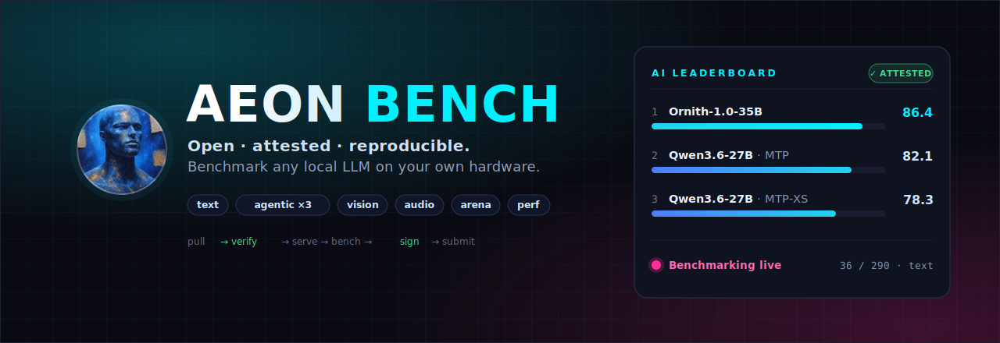

<p align="center">
  <a href="https://aeon-bench.com"></a>
</p>

# AEON Bench Pod

The **open benchmark pod** for [AEON Bench](https://aeon-bench.com): run the
full AEON suite against a model **on your own hardware**, with a controlled, verifiable pipeline —

```
pull (HuggingFace) → verify weights (LFS sha256 + manifest) → serve (recorded recipe)
→ benchmark (text · agentic ×3 harnesses · vision · audio · arena · perf)
→ sign (ed25519 device key) → submit (attested)
```

Results submitted through the controlled flow are **attested** and eligible for the global
leaderboard. Direct-endpoint runs are stored as *self-reported* — useful locally, never globally ranked.

## Quickstart — one command, prebuilt container

Pull the maintained multi-platform image (x86 / ARM / DGX Spark / Apple-silicon Docker Desktop)
and open the dashboard — everything happens from the GUI:

```bash
docker run -d --name aeon-pod --network host \
  -v /var/run/docker.sock:/var/run/docker.sock \
  -v aeon-pod-state:/root/.aeon \
  -v "$HOME/aeon-models:/models" -e AEON_MODELS_HOST_DIR="$HOME/aeon-models" \
  ghcr.io/aeon-7/aeon-pod:latest
# open http://localhost:8091 → Run tab
```

macOS (Docker Desktop has no host networking; Apple MLX serves bare-metal on the host):

```bash
docker run -d --name aeon-pod -p 8091:8091 \
  -v /var/run/docker.sock:/var/run/docker.sock \
  -v aeon-pod-state:/root/.aeon \
  -v "$HOME/aeon-models:/models" -e AEON_MODELS_HOST_DIR="$HOME/aeon-models" \
  ghcr.io/aeon-7/aeon-pod:latest
```

From the **Run tab**: paste an HF link (or a local weights folder + its HF link — hash-checked,
no re-download), watch the **VALIDATED MODEL** light go green, pick the engine container for your
hardware — **aeon-vllm-ultimate** (AEON's own optimal engine, the one behind the official boards),
**vLLM**, **SGLang**, **llama.cpp**, **vLLM ROCm**, a **custom image**, or **Apple MLX** (bare-metal;
the startup recipe is recorded exactly like a docker recipe) — and launch. The pod validates,
serves, benchmarks, signs, submits: **attested**, replicable, on the global board.

The mounts, in one line each: the **docker socket** lets the pod launch engine + harness
containers; **aeon-pod-state** persists your ed25519 device key + local runs; **/models** (with
`AEON_MODELS_HOST_DIR` naming its host path) is where validated weights live so sibling engine
containers can mount them.

<details><summary>Alternative: full pipeline via compose (build from source)</summary>

```bash
git clone https://github.com/AEON-7/Aeon-Bench-Pod.git && cd Aeon-Bench-Pod
AEON_HF_LINK=org/Your-Model  docker compose -f deploy/pod/docker-compose.yml up --build
# pull → hash-verify → serve → bench (incl. Hermes/OpenClaw/OpenCode) → submit to aeon-bench.com
```
(Copy `deploy/pod/.env.example` to `.env` only to override a default or add an `HF_TOKEN`.)
</details>

Docs: [`docs/pod-quickstart.md`](docs/pod-quickstart.md) ·
[`docs/run-a-benchmark.md`](docs/run-a-benchmark.md) ·
[`docs/attestation.md`](docs/attestation.md) · [`deploy/pod/AGENTS.md`](deploy/pod/AGENTS.md)

## What a full attested run measures

| Dimension | Suite | How |
|---|---|---|
| Text (5 categories × 4 difficulty tiers) | `aeon-suite-v2` | deterministic Tier-0 + binary-rubric Tier-1 |
| Agentic | `aeon-agentic-v2` | 16 environment-execution tasks (file ops + app/game/animation codegen) through **three real harnesses** (Hermes / OpenClaw / OpenCode) in fresh containers, scored on observable file outcomes |
| Vision | `aeon-mvp-vision` | probe-gated image suite |
| Audio | `aeon-audio-v1` | probe-gated, deterministic synthetic stimuli |
| Generative arena | apps / games / animations | seeded prompts, artifacts ship with the signed bundle |
| Performance | `aeon-perf-v1` | direct + through-harness grid, c=1…32, aggregate tok/s + TTFT |

Every run carries its **serve recipe** (exact docker command, engine version, flags), **verified
weights hash** (`repo@revision`), and **detected hardware** — so anyone can reproduce it.

## Trust model (short version)

The pod holds an ed25519 **device key** (`~/.aeon/device_key.pem`). Submissions are signed bundles
over the full result set; the mothership verifies signature + weight verification metadata and
tiers the run (`attested` / `self_reported`). See [`docs/attestation.md`](docs/attestation.md).

---
*Private during hardening — see [`PRE-PUBLIC-CHECKLIST.md`](PRE-PUBLIC-CHECKLIST.md) before flipping public.*
