# AEON Bench — A Guided Tour

**AEON Bench is an honest, independent, reproducible leaderboard for open AI models — one you run yourself.** Pull any open model from Hugging Face, benchmark its *quality*, its *real speed*, its *agentic* skill, and its *vision / audio / video* ability on **your own hardware**, then submit a cryptographically-verified result to a public board where every number is reproducible and signed for provenance.

The short version: most AI leaderboards ask you to trust a marketing number. AEON Bench asks you to trust **math instead** — every ranked result proves *which exact model* produced it, *on what recipe*, signed by the machine that ran it. If you can't reproduce it, it doesn't rank.

This page is a friendly, screenshot-by-screenshot tour of what you get. No setup required to read it — grab a coffee and scroll.

> **In a hurry?** Jump to [Run your own benchmark](#run-your-own-benchmark--the-run-tab), the [one-click champion recipes](#one-click-champion-recipes--the-easy-button), or ["I don't want to set this up myself"](#dont-want-to-set-this-up-yourself).

---

## The public leaderboard

**This is the scoreboard — a ranked list of open models, best at the top.** Each row is one model with a single big **composite quality score**, a breakdown of *what it's good at*, and how *fast* it actually runs.

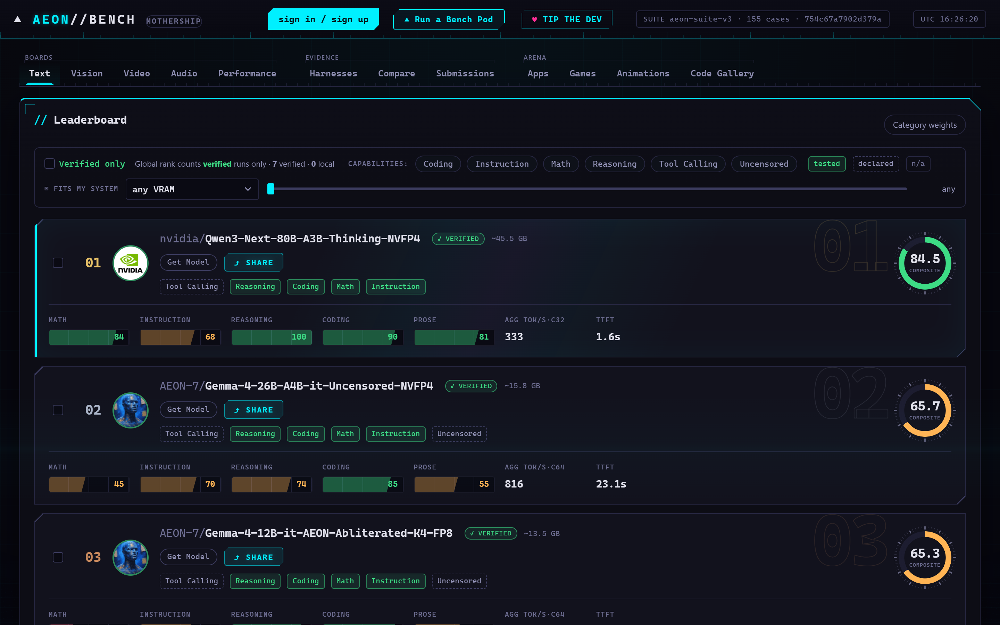

*The Text board. #1 is Qwen3-Next-80B at a composite **86.2**, VERIFIED, ~45.5 GB — with per-category bars (Math / Instruction / Reasoning / Coding / Prose), aggregate tokens-per-second, and time-to-first-token right on the card.*

Reading a card takes five seconds:

- **The big number** (that green ring, e.g. `86.2`) is the **composite quality** — one blended score across every skill category.
- **The colored bars** break that down: how the model does at **Math, Instruction-following, Reasoning, Coding, and Prose**. Green = strong, amber = weaker. You see a model's *shape*, not just its rank.
- **AGG TOK/S** and **TTFT** are the honest speed numbers — real measured throughput and how long you wait for the first word. Notice #1 scores higher but is *slower* than #2 (323 vs 816 tok/s). **Quality and speed are separate truths, and the board shows both.**
- **✓ VERIFIED** is the whole point (more below). The **Verified only** toggle hides everything that isn't independently proven — *"Global rank counts verified runs only."*
- **GET MODEL** takes you straight to the model; **SHARE** makes a link.

**The two filters that make it personal:**

- **Capability chips** (Coding / Instruction / Math / Reasoning / Tool Calling / Uncensored) — click to find the best model *for the thing you actually do*.
- **FITS MY SYSTEM** — a VRAM slider. Set your card's memory and the board hides models that won't fit. **"Best model I can actually run"**, in one drag.

Across the top you'll also spot the other boards this tour visits — **Vision, Video, Audio, Performance**, your own **Live / Run / Compare / Submissions** lab, and the **Arena** galleries.

---

## Run your own benchmark — the Run tab

**Here's the part no other leaderboard lets you do: run it yourself.** The Run tab is where you point AEON Bench at a model and say *go*. And the single most important idea is right here:

> **You paste a Hugging Face link (or pick a model already on your disk), and before it runs a single test, the pod downloads the model and cryptographically hash-checks every file against what Hugging Face publishes.**

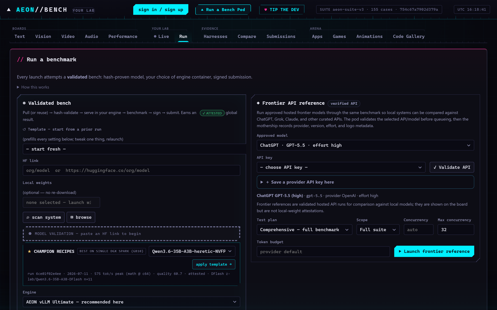

*The Run tab's "Validated bench" card — everything you need in one place: paste a link, pick a model on disk, grab a champion recipe, choose an engine.*

**Why the hash-check matters (in plain English):** it's a fingerprint. It proves the numbers you're about to generate came from the *real, unmodified* model — not a secretly fine-tuned, quantized, or swapped-out impostor. **That fingerprint is what turns a private benchmark into a number the whole world can trust.**

Paste a link and the card fills itself in — engine, recipe, speculative decoding, test plan — all on one screen:

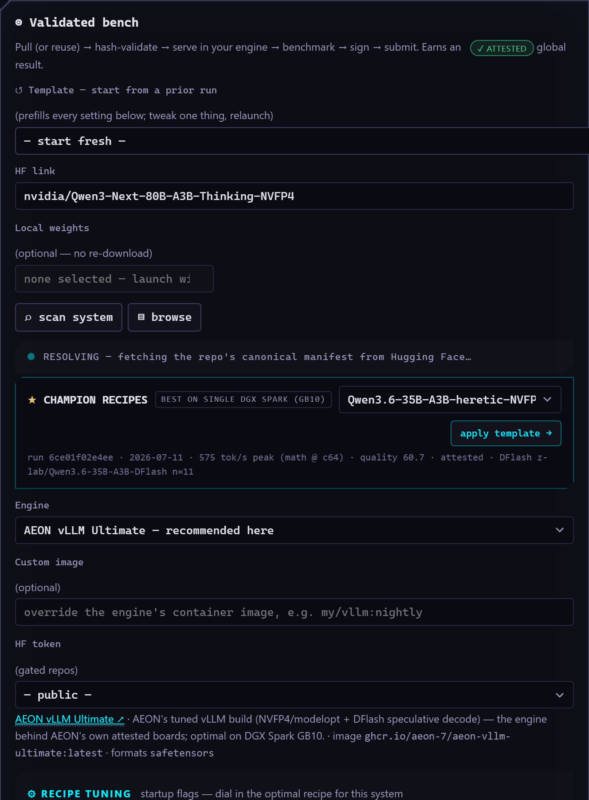

*Paste `nvidia/Qwen3-Next-80B-A3B-Thinking-NVFP4` and the whole configuration surface appears at once. The pod resolves the exact model, then everything below tunes how it runs.*

You'll see the model settle into one of two green states, and **both are trustworthy**:

- **RESOLVED** — you don't have the model yet. Launch will **pull it fresh and hash-verify it as it downloads.** Still fully attested.
- **VALIDATED** — you already have a copy on disk that is **bit-for-bit identical** to Hugging Face. No re-download needed — *"good as gold."*

Either way, the launch submits an **attested** result. The only way to *lose* that status is a mismatch (wrong bytes) — in which case the run stays local and never ranks, exactly as it should.

---

## Use a model already on your machine

**Already downloaded a model? Don't download it again.** AEON Bench scans your disk, finds every model you already have, and hash-checks it against Hugging Face in place.

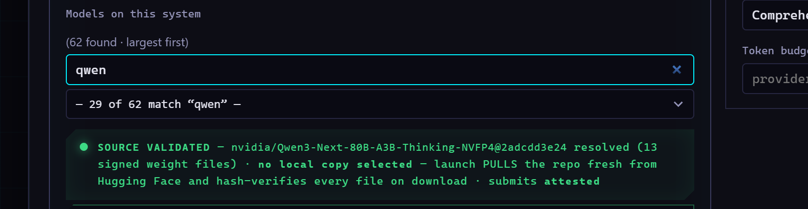

*"Models on this system" after a **⌕ scan**, filtered to "qwen". Each entry is a model already on your disk — the pod matches it to its Hugging Face card and verifies the bytes, no re-download.*

Hit **⌕ scan system** and the pod sweeps the usual hiding places — your Hugging Face cache, an LM Studio library, AEON's own model folder, wherever you keep weights — and lists what it finds. Prefer to point at a folder yourself? **▤ browse** walks your disk one directory at a time.

The clever bit: **scanning only reads file names and sizes, never the contents**, so it's instant. Then, once you pick a model, the pod does the real work — sha256-hashing every weight file and comparing it to Hugging Face's published fingerprints. **On-disk convenience, full-download trust.** A matched copy is *"attested from local weights, no re-download."*

---

## One-click champion recipes — the easy button

**This is the feature that makes AEON Bench feel like magic.** Getting an AI model to run *fast* usually means a PhD's worth of arcane settings. AEON Bench skips all of that: **the board already knows the best-performing setup for your exact hardware, and hands it to you in one click.**

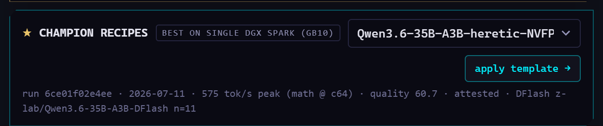

*"★ CHAMPION RECIPES — best on Single DGX Spark (GB10)." The board detected the hardware and offers the winning setup: **575 tok/s peak, quality 60.7, attested**, using a DFlash drafter at n=11 — with a one-click **apply template →**. The provenance line names the exact winning run (`6ce01f02e4ee`, 2026-07-11).*

Here's what's happening: every attested run on the public board records *the recipe that produced it*. So the leaderboard knows, for a **Single DGX Spark (GB10)** like the one here, which model-and-settings combo actually hit the fastest verified speed. **Apply template →** drops that entire winning recipe — engine, every flag, the speculative-decoding config, the drafter model — straight into your Run tab.

**And it's a starting point, not a cage.** Everything it fills in stays fully editable. Grab the champion, then tweak to taste.

---

## Recipe tuning made human

**Every engine setting is explained like a human wrote it.** Instead of a wall of cryptic command-line flags, each setting is a clean card: what it does in plain English, its upsides in **green**, its risks in **amber**, and a warning *before you crash a run* if a setting fights your hardware.

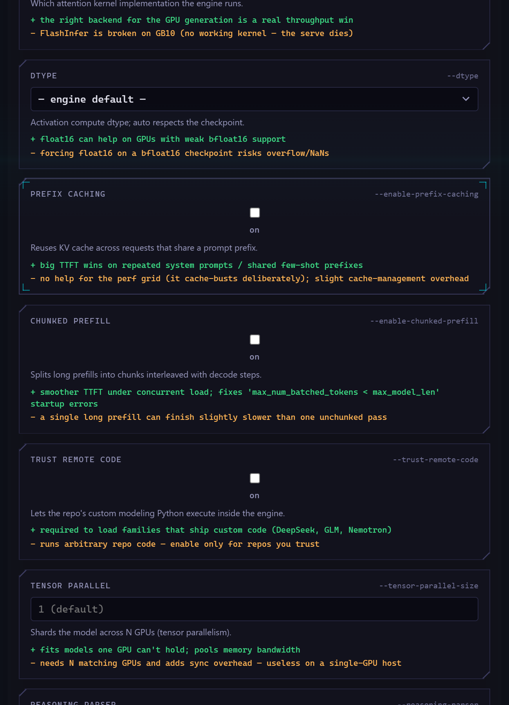

*Recipe Tuning. Each card names the real flag (DTYPE, PREFIX CACHING, CHUNKED PREFILL, TRUST REMOTE CODE, TENSOR PARALLEL, ATTENTION BACKEND…), gives you the control, explains it in one sentence, and lists **green "+" upsides** and **amber "−" trade-offs** — including live conflict warnings like "FlashInfer is broken on GB10."*

This is the **"you don't need a PhD"** feature. Two things make it friendly:

1. **Plain-English pros and cons on every card.** You always know *why* you'd flip a switch and *what it might cost you* — no more guessing from a man page.
2. **Live conflict warnings.** If a setting is known to break on *your* chip or *this* model, an amber strip tells you *before you launch* — not after a 20-minute crash. It warns; it never hard-blocks. You stay in control.

**The upshot: you can confidently tune a serious inference engine without ever reading its documentation.**

---

## Speculative decoding: free speed

**Speculative decoding is a trick that makes a model generate text faster — with zero loss in quality.** A small, fast helper guesses the next few words, and the big model just checks them in bulk instead of writing them one at a time. Same exact output, less waiting. AEON Bench gives you two flavors.

**Flavor 1 — Native MTP: free speed, no extra download.** Some models ship with their own built-in "guess-ahead" heads. If yours does, you just switch it on. Nothing else to download.

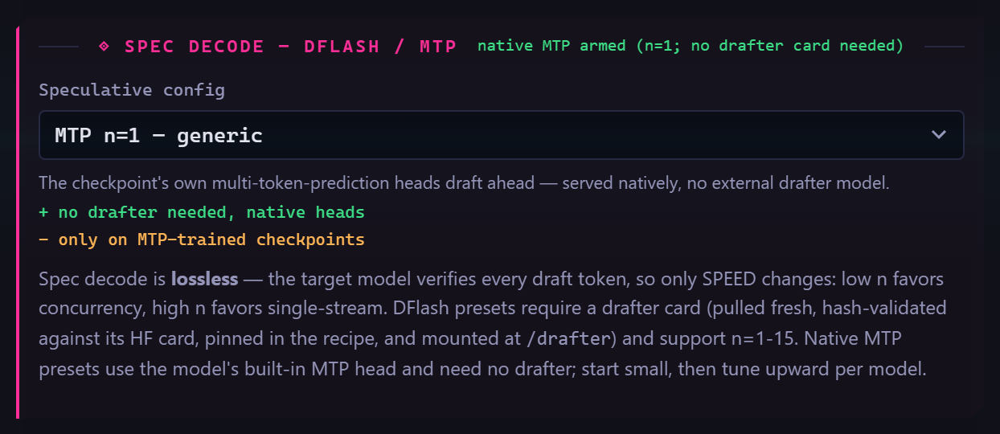

*Native **MTP** selected. The model's own multi-token-prediction heads do the guessing — **"+ no drafter needed, native heads,"** **"− only on MTP-trained checkpoints."** Lossless speedup, nothing to download.*

**Flavor 2 — DFlash: a tiny helper model does the guessing.** When a model doesn't have built-in heads, you can pair it with a small, separate "drafter" model. It's an extra (small) download, and it works with far more models.

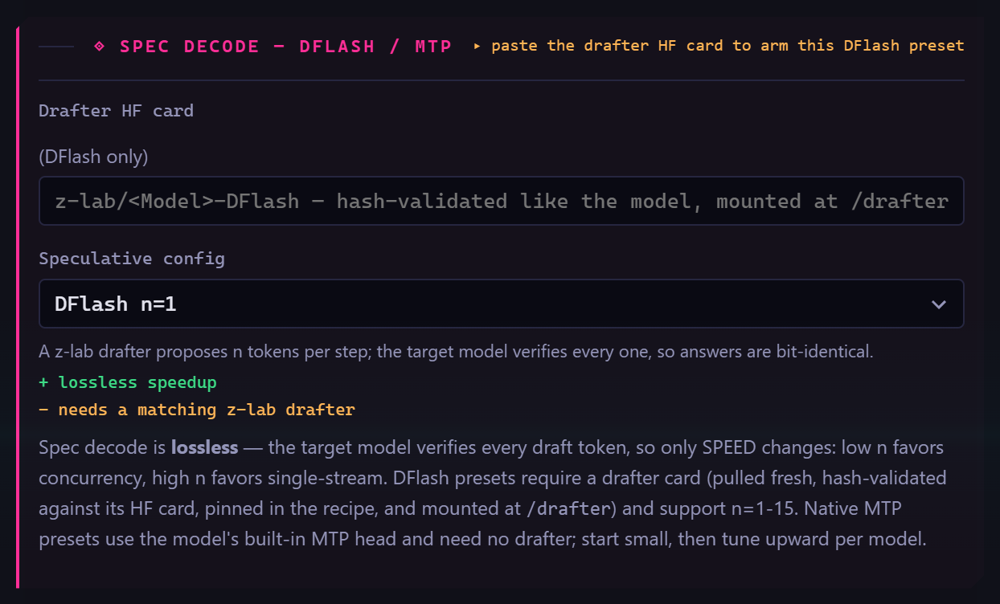

*Full **DFlash** selected. A small drafter model (its own hash-verified Hugging Face card) rides alongside the big one and can look up to 15 tokens ahead.*

**Either way it's lossless** — the big model has the final say on every token, so you get identical quality, just sooner. The champion recipe from earlier used DFlash at n=11; that's a big part of how it hit 575 tok/s.

---

## Multimodal in one row

**Models that can see, hear, or watch get tested on it too — automatically.** AEON Bench reads the model's own config, figures out whether it does vision, audio, or video, and switches on the right tests.

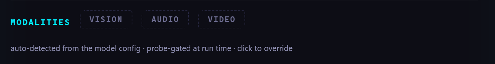

*The Modalities row. Vision / Audio / Video are **auto-detected from the model config and probed at run time** — and you can click any chip to force a modality on or skip it.*

You almost never touch this — **it just works from the model's config.** But if you know something the config doesn't (or want to skip a slow modality), one click overrides the auto-detection.

---

## Engines for every platform

**An "engine" is the software that runs the model. The default already matches your hardware — you rarely need to change it.**

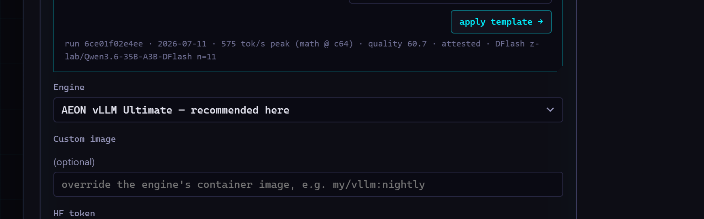

*The Engine picker. On this DGX Spark it defaults to **AEON vLLM Ultimate** (the recommended engine here), with a custom-image field and a saved-HF-token selector for gated models.*

Switch engines only if you have a reason to. The lineup:

- **AEON vLLM Ultimate / vLLM** — the fast default on NVIDIA GPUs (AEON's own boards run this).
- **SGLang** — an alternative high-performance server.
- **llama.cpp** — for GGUF-format models.
- **vLLM-ROCm** — for AMD GPUs.
- **Apple MLX / LM Studio** — bare-metal paths for a Mac or a desktop app, no container needed.

**The rule of thumb: leave it on the recommended engine unless a specific model or format requires otherwise.**

---

## The test plan & concurrency

**How thorough should the exam be? "Comprehensive" is the whole thing.** This row controls scope — and its defaults are already the right answer for a real leaderboard result.

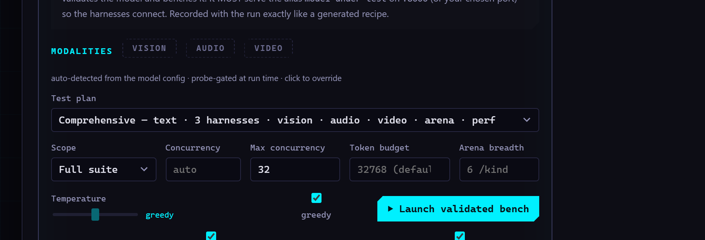

*The test-plan row: plan (**Comprehensive**), difficulty, concurrency (**auto**), max concurrency, token budget, arena breadth, and temperature / greedy controls.*

The plain-English guide:

- **Comprehensive** is the full exam: the text suite, **three agentic harnesses**, vision, audio, video, the arena, *and* a real-speed performance grid. **Only a comprehensive, complete run earns a global ranking** — partial or text-only runs are stored and viewable but never rank.
- **Concurrency is automatic.** AEON Bench sizes how many tests run at once to your GPU's memory. You can override it, but you don't need to.
- **Big models take a while — and that's expected.** A comprehensive pass is roughly **30–60 minutes on capable hardware**; a large model running *every* board plus the full speed ladder can stretch to **hours**. That's the price of a thorough, honest score. Get up, stretch — it's working.

---

## Results as unified cards

**One benchmark run = one tidy card that summarizes everything it measured.** No hunting across ten pages — a single card tells you the model, how it was verified, the hardware, the date, and a chip for *every* board it covered.

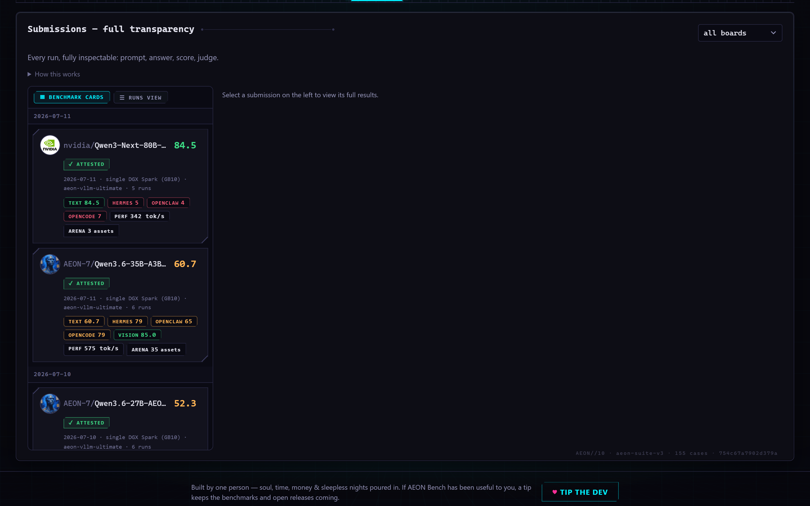

*Submissions as **unified benchmark cards** — one card per whole job. The chip row (**TEXT · HERMES · OPENCLAW · OPENCODE · VISION · PERF tok/s · ARENA**) shows every board that run touched. Click any chip for the full detail behind it.*

Each chip is a doorway: click **TEXT** for the quality breakdown, **PERF** for the speed grid, **HERMES / OPENCLAW / OPENCODE** for how the model did as an *agent* under each of the three harnesses. There's a **BENCHMARK CARDS / RUNS VIEW** toggle if you'd rather see the raw per-run list. **The card is the summary; the chips are the depth.**

---

## Compare anything, side by side

**Put two whole benchmarks next to each other and see exactly where they differ.** Not just one number — every board, lined up.

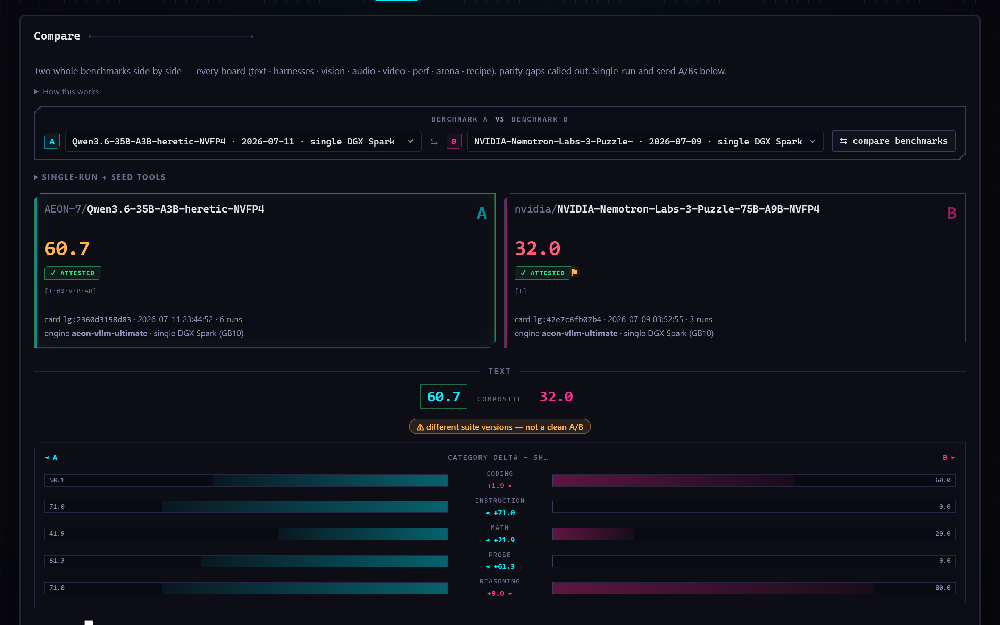

*Compare two entire benchmarks. **A is cyan, B is magenta**, aligned across every board. Where one run has results the other doesn't, you get an honest muted **"no results for this run"** plate instead of a misleading blank.*

The honest touch here is the **parity filler**. If model A ran vision tests and model B didn't, B doesn't just show an empty space that *looks* like a zero — it shows a clearly-labeled *"no results"* plate. **So you're always comparing apples to apples on the boards they actually share, and never fooled by a gap.**

*Here's the parity filler in action. Model A (left) ran the coding-agent harnesses and the vision board; model B (right) only did the text exam — so its side of those sections says **"no agentic harness results for this run"** rather than pretending it scored zero. You still see A's full results, and the text rows they share are compared normally (note the **"not in this run"** marker on a question B never attempted).*

---

## Performance by hardware

**Which model + recipe is fastest on *my kind of rig*? This board answers exactly that.** Results are grouped by the machine that produced them, so you compare like with like.

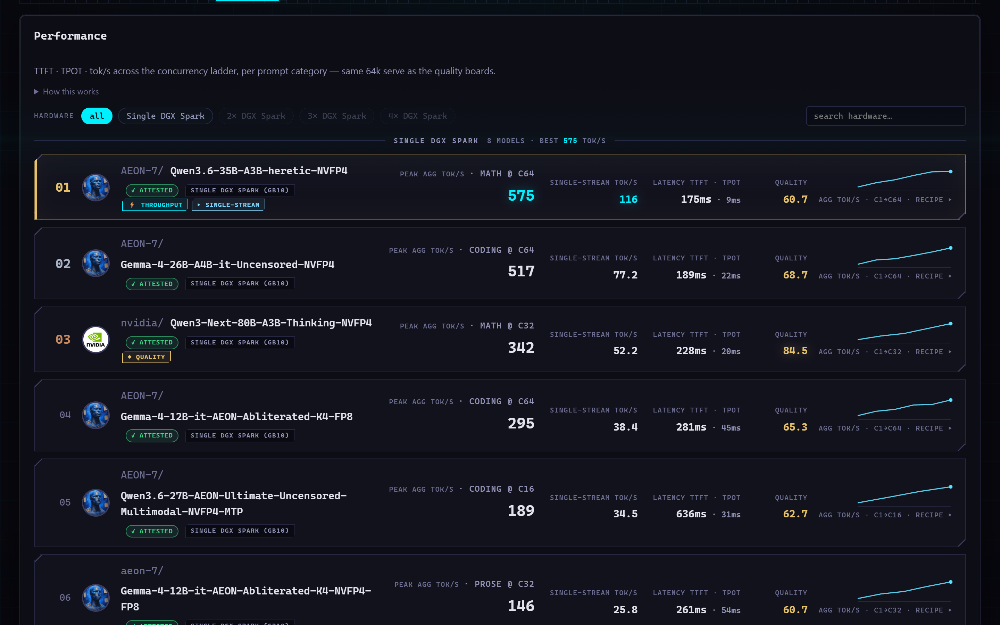

*The Performance board, **clustered by hardware**: "Single DGX Spark — N models · best NNN tok/s," with filter chips for 2× / 3× / 4× Spark and a search for other GPUs. Every card is tagged with its exact rig and peak throughput.*

Speed numbers only mean something *relative to the hardware*, so this board never mixes them up. Filter to your class of machine — a single Spark, a four-Spark cluster, a specific RTX card — and instantly see **the best model-and-recipe combination for a rig like yours.** This is where the champion recipes come from.

---

## The Code Gallery

**The models don't just answer questions — they build things, and you can play with what they built.** The Code Gallery is a wall of live, working artifacts the models generated during benchmarking.

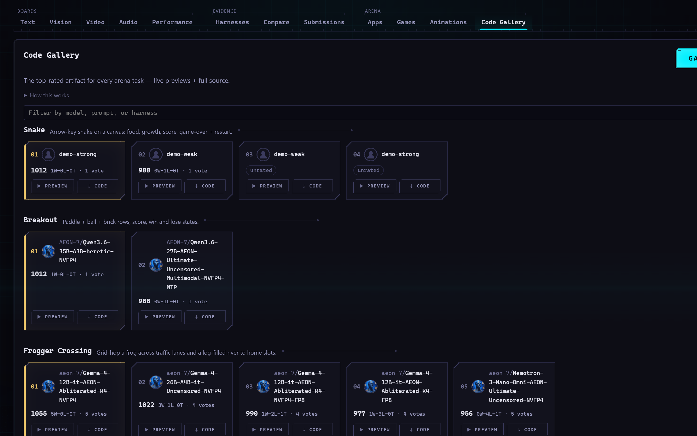

*The Code Gallery, with its big **GAMES / APPS / ANIMATIONS** switch (count badges included, the active one lit cyan) over a grid of real, generated artifacts.*

Flip between **GAMES**, **APPS**, and **ANIMATIONS** and open any tile — these are the actual, runnable things the models produced, not screenshots of them. **The most fun way to feel the difference between models: go play with their homework.**

---

## Vision & video boards

**Beyond text, AEON Bench runs dedicated boards for models that see and watch — and grades them without human bias.**

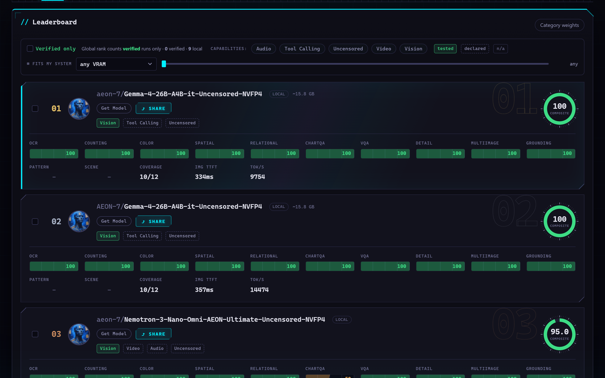

*The **Vision** board (`aeon-vision-v2`) — a harder synthetic vision suite, deterministically graded.*

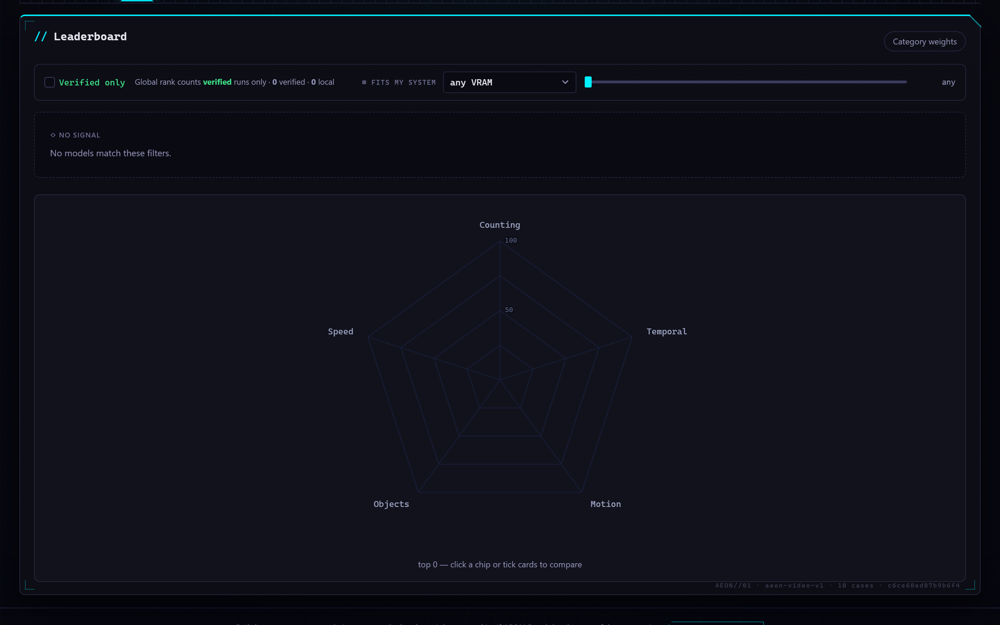

*The **Video** board (`aeon-video-v1`) — a deterministic video suite.*

These suites are **deterministically graded**, meaning the answer is checkable by machine — no subjective judge, no wiggle room. Same honest, reproducible standard as the text board, applied to pixels and frames. (There's an **Audio** board too, in the same family.)

---

## Watching it run + sharing with others

**While a benchmark runs, the dashboard turns into a live racing-dash.** There's no still image of it here because it's *alive* — but the moment you launch, the **Live** view lights up with a big dot-matrix readout:

- **Aggregate tokens/second** across every stream at once — the true, engine-wide throughput, ticking in real time.
- **Active streams** and **queued** requests — how hard the model is being pushed right now.
- A **peak-hold** high-water mark, so you can see the fastest moment of the run.

It looks like a scoreboard at a drag strip, and it updates every few seconds. **It's genuinely fun to watch a big model open up the throttle.**

**And you don't have to watch alone.** The dashboard is just a web page at **`http://localhost:8091`** — which means **anyone on your network can open `http://<your-machine>:8091` and watch the same live run.** Point a teammate at the URL and they see exactly what you see, in real time. No accounts, no screen-sharing.

---

## Don't want to set this up yourself?

> ### 🤖 Let an AI agent do the whole thing.
>
> **You don't have to touch Docker or a command line at all.** Point your AI coding agent — Claude, or any capable agent — at this repo's **[`AGENTS.md`](../../AGENTS.md)** and tell it to install AEON Bench and run the benchmark for you.
>
> `AGENTS.md` is a machine-readable playbook written *for the agent*: it knows how to install the pod wherever you want it, pull and verify a model, launch a comprehensive run, and hand you back the live dashboard URL to watch. **Your job shrinks to: "benchmark this model," and then opening a link.**

---

## Trust & how it works, briefly

**Here's the one paragraph that makes this whole board mean something.** Only **attested** runs rank on the public leaderboard. A run is attested when three things are true at once: the model's weights were **hash-verified bit-for-bit against Hugging Face** (proving it's the real, unmodified model), the **exact serving recipe** is recorded alongside it, and the whole result is **cryptographically signed** by the machine that produced it. When your result reaches the public board, **the mothership independently re-fetches Hugging Face and re-checks every weight hash before it counts.** A bundle with the wrong fingerprints is stored but **refused a ranking.**

Everything else — a quick test against some API endpoint, an unverifiable model — is kept and shown but badged **`local`**, never globally ranked. Run those all you like for your own curiosity.

**That's the entire difference between AEON Bench and a marketing slide:** here, a number that ranks is a number you (or anyone) can reproduce, tied by cryptography to the *precise* model and recipe that made it. Not "trust us." **Check the math.**

> **Go deeper:** [`docs/run-a-benchmark.md`](../run-a-benchmark.md) (the full run guide) · [`docs/pod-quickstart.md`](../pod-quickstart.md) (the 3-command version) · [`docs/attestation.md`](../attestation.md) (the trust-chain spec) · [`AGENTS.md`](../../AGENTS.md) (let an agent run it).
